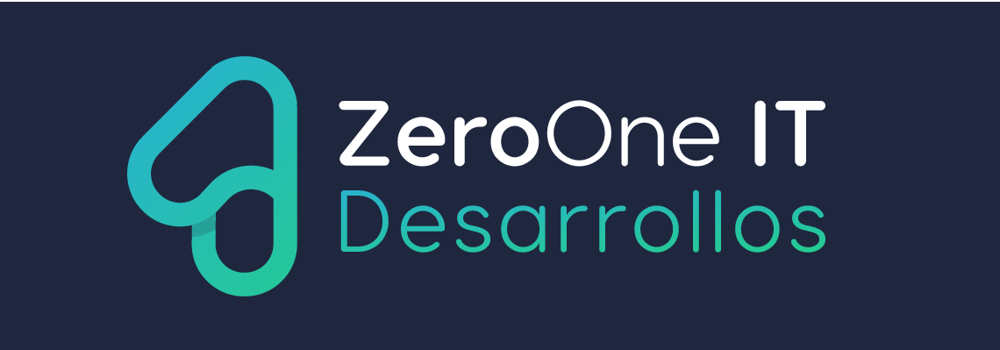

[](https://snyk.io//test/github/Zero-OneiT/expresive-tea?targetFile=package.json)
[](https://travis-ci.org/Zero-OneiT/expresive-tea)
[](https://codecov.io/gh/Zero-OneiT/expresive-tea)
[](https://codeclimate.com/github/Zero-OneiT/expresive-tea/maintainability)


[](https://app.fossa.io/projects/git%2Bgithub.com%2FZero-OneiT%2Fexpresive-tea?ref=badge_shield)


<!-- PROJECT LOGO -->
<br />
<p align="center">
  <a href="https://github.com/Zero-OneiT/expresive-tea">
    
  </a>

  <h3 align="center">Expressive Tea</h3>

  <p align="center">
    A Clean, simple, modulable, extendable ExpressJS over Typescript framework.
    <br />
    <a href="https://zero-oneit.github.io/expresive-tea/"><strong>Explore the docs »</strong></a>
    <br />
    <br />
    <a href="https://codesandbox.io/s/expressive-tea-2kmg7?fontsize=14&hidenavigation=1&theme=dark">View Demo</a>
    ·
    <a href="https://github.com/Zero-OneiT/expresive-tea/issues">Report Bug</a>
    ·
    <a href="https://github.com/Zero-OneiT/expresive-tea/issues">Request Feature</a>
  </p>
</p>

## About the project  
Expressive Tea is framework to help build server-side applications in [NodeJS](https://nodejs.org/) and use modern Javascript powered by 
[Typescript](https://www.typescriptlang.org/). As Expressive Tea is using [express](https://expressjs.com/) is compatible with all the middlewares and modules and provide 
an easy migration from express applications.

Expressive Tea is a flexible framework but also giving freedom to the developer to build their own architectures 
by providing descriptive decorators, a plugin engine, shareable modules and moder Javascript.

### Motivation
Server-side applications it contains awesome tools, helpers, and libraries to improve productivity but at same time it
haves a large downside, **architecture**. Expressive Tea main motivation is relief the stress of the architecture by 
providing a shareable/pluggable projects, you can write a plugin to setting up express middlewares, databases settings,
or websockets to name some; and you can share them through your next projects or the community.

Main goal is making uncomplicaded creation of server-side applications, modulables, plugables, free and efortless 
architecture.
   
### Features
* Easy Setting up and start up of webserver.
* Extends and configuration with plugins and well-defined boot stages.
* Modules are not hard dependencies and can be shareable between projects.
* Declare Server Middlewares configuration as hard or soft dependency at server level.
* Dependency Injection is available for controllers as providers declared in modules using InversifyJs.
* Declarative Router on Controllers.
* Declarative Verbs and Middlewares under module and verb level.
* Declarative Exceptions for a better Error Handling.

### Built With

* [Express](https://github.com/expressjs/express) - The web framework used
* [Typescript](https://www.typescriptlang.org/) - Main Language
* [Inversify](https://github.com/inversify/InversifyJS/) - Used for dependency Injection
* [Reflect Metadata](https://github.com/rbuckton/reflect-metadata) - Used to get code metadata.

## Getting Started

### Prerequisites

**Important!** Expressive Tea requires Node >= 6, Express >= 4, TypeScript >= 2.0 and the `experimentalDecorators`, 
`lib` compilation options in your `tsconfig.json` with the next configuration.

Expressive Tea is not having any configuration of any Express Plugin or any database connection beside is built it 
on Express it is woking as **Bring Your Own Architecture**.

### Installation
```bash
npm i --save @zerooneit/expressive-tea
```

## Setting up Typescript

```json
{
  "compilerOptions": {
    "baseUrl": ".",
    "sourceMap": true,
    "noEmit": true,
    "noImplicitAny": true,
    "target": "es6",
    "lib": ["es6", "dom"],
    "module": "commonjs",
    "moduleResolution": "node",
    "experimentalDecorators": true,
    "emitDecoratorMetadata": true
  }
}
```
### Examples
You can looking into our simple example [here](https://github.com/Zero-OneiT/expressive-tea-sandbox).

or edit or see how is working [](https://codesandbox.io/s/expressive-tea-2kmg7?fontsize=14&hidenavigation=1&module=%2Fmain.ts&theme=dark)

## Contributing

Please read [CONTRIBUTING.md](https://gist.github.com/PurpleBooth/b24679402957c63ec426) for details on our code of conduct, and the process for submitting pull requests to us.

## Versioning

We use [SemVer](http://semver.org/) for versioning. For the versions available, see the [tags on this repository](https://github.com/your/project/tags). 

## Contributors

* **Diego Resendez** - *Lead Developer / Author* - [zerooneit](https://github.com/zerooneit)

See also the list of [contributors](https://github.com/Zero-OneiT/expresive-tea/contributors) who participated in this project.

## Support
If you are experience any kind of issues we will be happy to help. You can report an issue using the [issues page](https://github.com/Zero-OneiT/expresive-tea/issues) or the [chat](https://gitter.im/Zero-OneiT/expresive-tea). You can also ask questions at [Stack overflow](http://stackoverflow.com/tags/expressive-tea) using the `expressive-tea` tag.

If you want to share your thoughts with the development team or join us you will be able to do so using the [official the mailing list](https://groups.google.com/forum/#!forum/expressive-tea/). You can check out the
[wiki](https://github.com/Zero-OneiT/expresive-tea/blob/develop/README.md) to learn more about Expressive Tea internals or check our [documentation](https://zero-oneit.github.io/expresive-tea/).

Expressive Tea is an open source project, our goal is create an awesome framework that helps to build marvelous server side applications. If you like to join as Sponsor or backer to continue grow, please you can contact us on [projects@zero-oneit.com](mailto:projects@zero-oneit.com)
#### Principal Sponsors

<table style="text-align:center;"><tr><td>
<a href="https://zerooneit.com" target="_blank"></a></td><td>
</tr></table>


## Stay on Touch

* Author - [Diego Resendez](https://twitter.com/diegoresendez)
* Twitter - [@expressive_tea](https://twitter.com/expressive_tea)
* Email - [contact@zero-oneit.com](mailto:contact@zero-oneit.com)

## License
This project is licensed under the Apache-2.0 License - see the [LICENSE](LICENSE) file for details

[](https://app.fossa.io/projects/git%2Bgithub.com%2FZero-OneiT%2Fexpresive-tea?ref=badge_large)

## Disclaimers
The banner and the logo is a derivate work [Designed by Freepik](http://www.freepik.com)
