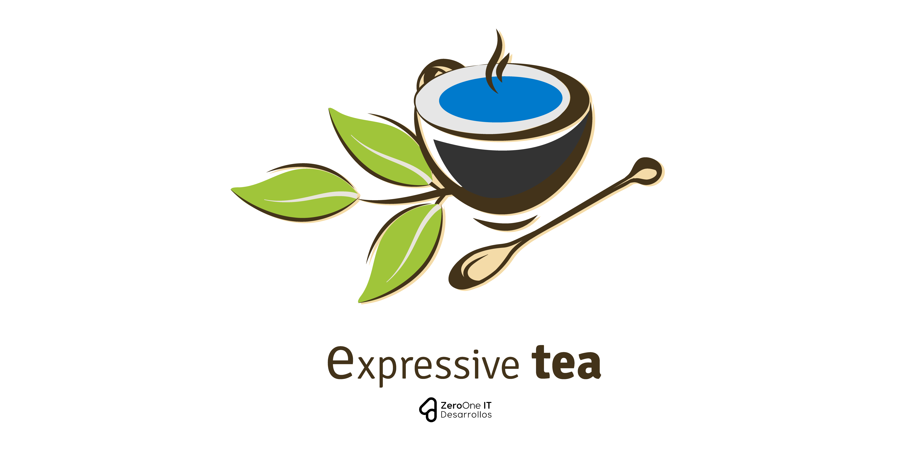

# Expressive Tea

[](https://snyk.io//test/github/Zero-OneiT/expresive-tea?targetFile=package.json)
[](https://travis-ci.org/Zero-OneiT/expresive-tea)
[](https://codecov.io/gh/Zero-OneiT/expresive-tea)
[](https://codeclimate.com/github/Zero-OneiT/expresive-tea/maintainability)


[](https://app.fossa.io/projects/git%2Bgithub.com%2FZero-OneiT%2Fexpresive-tea?ref=badge_shield)


> A Typescript library to create RESTful Services.

## Description
Expressive Tea is a simple library which allow to generate RESTful services with Typescript over Expressjs.

## Features
* Server Initialization and Configurations with ability to setup server through server stages.
* Declare Server Middlewares configuration as hard or soft dependency at server level.
* Declarative Modules to allow create modular RESTful Servers.
* Dependency Injection on controllers as providers with InversifyJs.
* Declarative Router on Controllers.
* Declarative Verbs and Middlewares under module and verb level.
* Declarative Exceptions for a better Error Handling.
* Can declare models depending on your flavor, we recommend Mongoose or Sequelize flavors.


## Motivation
The main idea is help developers to generate a RESTful service quick and modulable through descriptive decorators and settings
on top of ExpressJS. Expressive Tea is a clean, simple and descriptive mini framework which allow create REST services quickly
saving time with the creation of routers and other express components with a clean, descriptive decorator.

## Installation
```bash
npm i --save @zerooneit/expressive-tea
```

> **Important!** Expressive Tea requires Node >= 6, Express >= 4, TypeScript >= 2.0 and the `experimentalDecorators`, 
`lib` compilation options in your `tsconfig.json` with the next configuration.

```json
{
  "compilerOptions": {
    "baseUrl": ".",
    "sourceMap": true,
    "noEmit": false,
    "noImplicitAny": false,
    "target": "es6",
    "lib": [
      "es6",
      "dom"
    ],
    "types": [
      "reflect-metadata"
    ],
    "module": "commonjs",
    "moduleResolution": "node",
    "experimentalDecorators": true,
    "emitDecoratorMetadata": true,
    "declaration": true
  },
  "include": [
    "node_modules/@zerooneit/expressive-tea"
  ]
}
```
### Examples
You can looking into our simple example [here](https://github.com/Zero-OneiT/expressive-tea-example).

## Quick Start
### Boot Stages
The Application internally is ordering the plugs on the next order:

**BOOT_DEPENDENCIES**: This is executing when express server applications is created.

**INITIALIZE_MIDDLEWARES**: Global middleware initialization.

**APPLICATION**: This should contain express configuration or application configurations.

***MODULES***: This is an internal stage that is used only to create the modules.

**AFTER_APPLICATION_MIDDLEWARES**: Middlewares commonly used after setup the modules, commonly for error handler.

**START**: Can be used to add additional configuration as websocket implementation or another service.
  
### Declare a Server
```typescript
import Boot from '@zerooneit/expressive-tea/classes/Boot';
import { BOOT_STAGES } from '@zerooneit/expressive-tea/libs/constants';
import { Plug, ServerSettings, RegisterModule } from '@zerooneit/expressive-tea/decorators/server';
import RootModule from './app/Root/RootModule';
import logSetting from './config/TestPlug';

@ServerSettings({
	port: 3001
})

@Plug(BOOT_STAGES.BOOT_DEPENDENCIES, 'Log Middleware', logSetting)
class BootLoader extends Boot {
	@RegisterModule(RootModule)
	async start() {
		super.start();
	}
}

export default new BootLoader().start()
  .catch(error => console.log(error.message));
```
### Generate A Plug Setting
The plugin always needs to be a method which is receiving express server application.

```typescript
export default function testPlug(server) {
    server.use(function(req, res, next) {
        console.log('This should be executed everytime in all the endpoints');
        next();
    });
}

```

### Generate Modules
```typescript
import { Module } from '@zerooneit/expressive-tea/decorators/module';
import RootController from './controllers/RootController';
import TestService from './services/TestService';

@Module({
	controllers: [RootController], // Controllers Defined
	providers: [TestService], // Dependency Injection Providers
	mountpoint: '/' // Mountpoint Route starting from root.
})
export default class TestModule {}

```

### Generate Controllers
```typescript
import { Get, Route } from '@zerooneit/expressive-tea/decorators/router';
import { Inject } from '@zerooneit/expressive-tea/services/DependencyInjection';

@Route('/')
export default class RootController {
  /**
  * Injected Provider Instance into controller property 
  */
	@Inject('TestService')
	testService; 
  
	// Set and enpoint over module root endpoint
	@Get('/')
	async index(req, res) {
		res.send('is Working!!');
	}

	@Get('/test')
	async test(req, res) {
		res.json({success: true, message: 'this is working too'});
	}

	@Get('/test/inject')
	async testInject(req, res) {
		res.send(this.testService.test());
	}
}

```

### Generate Injectable Service
```typescript
import {injectable} from 'inversify';

@injectable()
export default class TestService {
    test() {
        return 'This is a injectable service';
    }
}}

```
## Support
If you are experience any kind of issues we will be happy to help. You can report an issue using the [issues page](https://github.com/Zero-OneiT/expresive-tea/issues) or the [chat](https://gitter.im/Zero-OneiT/expresive-tea). You can also ask questions at [Stack overflow](http://stackoverflow.com/tags/expressive-tea) using the `expressive-tea` tag.

If you want to share your thoughts with the development team or join us you will be able to do so using the [official the mailing list](https://groups.google.com/forum/#!forum/expressive-tea/). You can check out the
[wiki](https://github.com/Zero-OneiT/expresive-tea/blob/develop/README.md) to learn more about Expressive Tea internals or check our [documentation](https://zero-oneit.github.io/expresive-tea/).

## Built With

* [Express](https://github.com/expressjs/express) - The web framework used
* [Typescript](https://www.typescriptlang.org/) - Main Language
* [Inversify](https://github.com/inversify/InversifyJS/) - Used for dependency Injection
* [Reflect Metadata](https://github.com/rbuckton/reflect-metadata) - Used to get code metadata.

## Contributing

Please read [CONTRIBUTING.md](https://gist.github.com/PurpleBooth/b24679402957c63ec426) for details on our code of conduct, and the process for submitting pull requests to us.

## Versioning

We use [SemVer](http://semver.org/) for versioning. For the versions available, see the [tags on this repository](https://github.com/your/project/tags). 

## Authors

* **Diego Resendez** - *Initial work* - [zerooneit](https://github.com/zerooneit)

See also the list of [contributors](https://github.com/Zero-OneiT/expresive-tea/contributors) who participated in this project.

## License

This project is licensed under the Apache-2.0 License - see the [LICENSE](LICENSE) file for details


[](https://app.fossa.io/projects/git%2Bgithub.com%2FZero-OneiT%2Fexpresive-tea?ref=badge_large)
